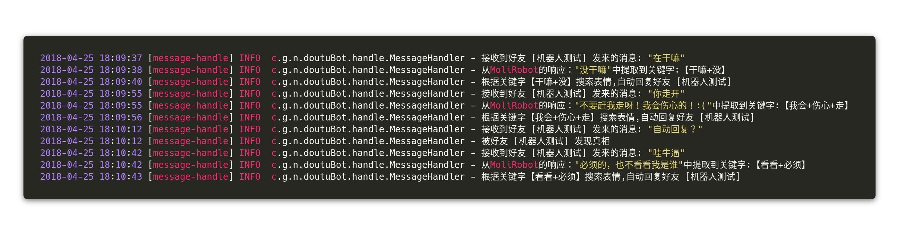

# wechat-robot4doutu
斗图专用机器人！边挂机边怼人，终于可以不看手机尽情的写代码了 
# 原理
**api，技术：**
 - **[wechat-api](https://github.com/biezhi/wechat-api)** : Java的微信接口，啥都能干
 - **[HanLP](https://github.com/hankcs/HanLP)**：中文分词处理
 - **[图灵机器人API](http://www.tuling123.com/)** ：自动回复机器人
 - **[茉莉机器人API](http://www.itpk.cn/)** ：自动回复机器人
 - **[斗图啦接口](https://www.doutula.com/apidoc)** ： 表情包搜索接口  

把机器人的回答用HanLP进行处理，找出关键词。通过斗图啦接口获取合适的表情，用表情包自动回复发送方。
目前对文字以外的类型暂不支持，随机返回assets/default-emos目录下的表情

# 怎么用？
运行Main.java中的main方法，扫码登录就OK了
# 能用来干嘛？
### 可以这样 ！

### 还可以这样！

